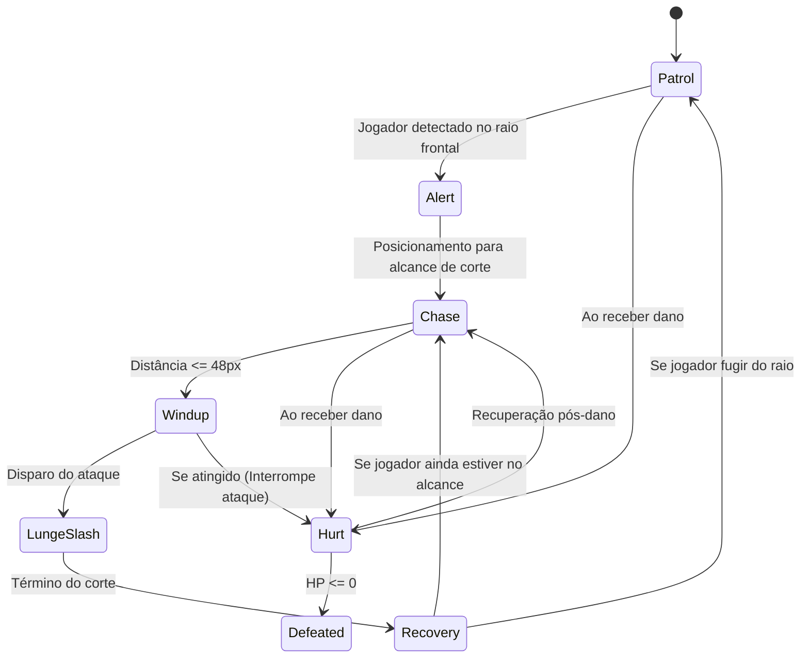

# 🦎 Ficha Técnica de Design: Bandido Iguana Ronin (Iguana Bandit)

Documento oficial de especificações visuais, combate e animação do primeiro inimigo comum para o jogo de ação/plataforma 2D.

---

## 1. 📖 Visão Geral & Arquétipo

| Atributo | Descrição |
|---|---|
| **Nome do Inimigo** | Bandido Iguana Ronin (*Iguana Bandit*) |
| **Tipo / Tier** | Inimigo Básico de Patrulha / Solo (*Melee Mob Tier 1*) |
| **Arquétipo de Combate** | Salteador agressivo em postura baixa, ataques rápidos com adaga e investida frontal |
| **Comportamento Base** | Patrulha cadenciada de rotas; ao avistar o jogador, entra em alerta rápido e desfere um *Lunge Slash* |
| **Arma Principal** | Adaga Japonesa Tradicional (*Tanto*) de lâmina curta curvada |

---

## 2. 🎨 Guia Visual & Paleta de Cores

O design foi concebido para manter coerência estilística estrita com o protagonista **Gato Samurai**, utilizando alto contraste cromático (paleta fria e terrosa vs paleta quente do herói).

```
          [ Crista e Escamas Dorsais ]
          #4F6D38 (Verde Musgo Escuro)
                     │
    ┌────────────────┴────────────────┐
    │                                 │
[ Escamas Base ]              [ Olhos / Dentes ]
#7A9A50 (Verde Oliva)         #E5B232 (Âmbar Reptiliano)
#9BBF68 (Realces de Luz)      #20150A (Pupila Vertical)
    │                                 │
    └────────────────┬────────────────┘
                     │
          [ Vestimenta / Quimono ]
          #435773 (Azul Índigo Desgastado)
          #6A526E (Roxo Queimado Suave)
          #D2CCBA (Bandagens Sarashi/Kyahan)
          #22252A (Faixa Obi / Bainha Saya)
                     │
          [ Lâmina da Adaga Tanto ]
          #E4E8EE (Aço Polido)
          #8A95A5 (Sombra da Lâmina)
```

---

## 3. ⚔️ Atributos de Combate & IA

| Parâmetro | Valor Sugerido | Notas de Balanceamento |
|---|:---:|---|
| **Pontos de Vida (HP)** | `45 HP` | Derrotado com 2 a 3 golpes básicos de katana do herói |
| **Dano por Ataque** | `12 DMG` | Ataque punitivo em caso de esquiva tardia |
| **Velocidade de Patrulha** | `65 px/s` | Movimento cadenciado e rasteiro |
| **Velocidade de Investida (Chase)** | `140 px/s` | Arrancada rápida para fechar distância |
| **Raio de Detecção** | `160 px` | Visão frontal de 120° |
| **Cooldown de Ataque** | `1.4s` | Janela de recuperação para o jogador contra-atacar |

### 🤖 Fluxo de Estados da IA (State Machine)


---

## 4. 🎞️ Matriz de Animações (Padrão 256x256 px)

| Animação | Frames | FPS | Duração | Descrição do Movimento |
|---|:---:|:---:|:---:|---|
| **Idle** | 5 | 5 FPS | 1.00s | Respiração com oscilação do papo/tórax, pupilas alertas e ondulação da cauda |
| **Walk / Patrol** | 8 | 10 FPS | 0.80s | Caminhada rasteira empunhando a adaga em guarda baixa |
| **Attack / Lunge** | 6 | 12 FPS | 0.50s | 2 frames de windup + 2 frames de corte lunge frontal + 2 frames de guarda |
| **Hurt** | 3 | 10 FPS | 0.30s | Recuo para trás com tremor de impacto e expressão de dor |
| **Death / Defeat** | 6 | 8 FPS | 0.75s | Queda ao chão, largando a adaga e dissipando em fumaça/fadeout |

---

## 5. ⚙️ Especificações de Integração Técnica

- **Tamanho da Célula**: `256 x 256 px`
- **Fundo**: `RGBA 32-bit (Transparente)`
- **Ponto de Pivot dos Pés**: `X = 128px (50%)`, `Y = 224px (87.5%)` *(Perfeitamente alinhado com o Gato Samurai)*

### Configuração no Godot Engine 4.x
```gdscript
# Exemplo de configuração de nó no Godot 4
extends CharacterBody2D

@onready var sprite = $AnimatedSprite2D

func _ready():
    # Pivot nos pés para garantir física e colisão congruentes
    sprite.offset = Vector2(0, -112)
```

### Configuração no Unity 2D
- **Texture Type**: `Sprite (2D and UI)`
- **Sprite Mode**: `Multiple`
- **Grid By Cell Size**: `256 x 256`
- **Pivot**: `Custom (X = 0.5, Y = 0.125)`
